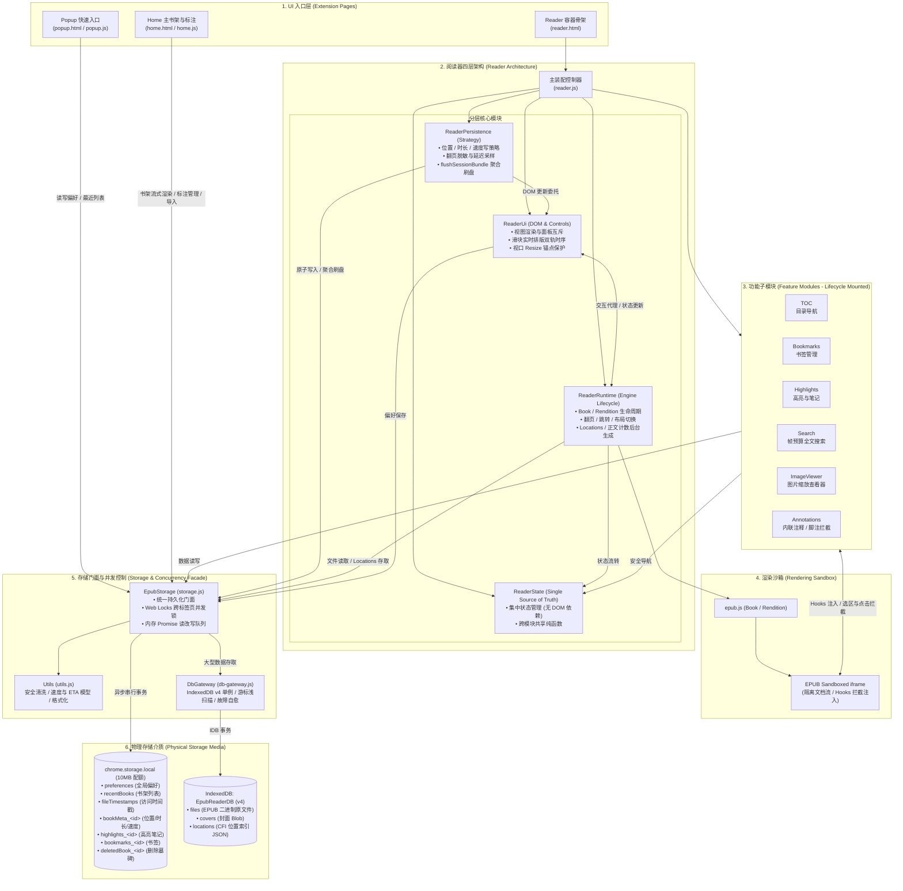

# EPUB Reader — 模块与架构参考

版本：v2.5.46  
更新：2026-08-30  

本文档包含项目系统架构、核心数据模型、模块接口契约与关键调度约束。

---

## 1. 系统架构与交互流

### 1.1 宏观架构图



### 1.2 页面间通信与数据流向契约

| 交互路径 | 通信方式 | 并发控制机制 | 异常降级策略 |
|---|---|---|---|
| **页面跳转路由** | URL 查询参数（`?bookId=<id>`、`?target=<cfi>`） | 无状态跳转 | 参数缺失或非法回退欢迎屏 |
| **偏好设置同步** | `chrome.storage.local` + `storage.onChanged` | `_enqueueKeyWrite` 内存队列 + Web Lock 独占锁 | 读取失败使用内置默认配置 |
| **最近书籍管理** | `EpubStorage.addRecentBook` / `removeRecentBook` | 针对 `recentBooks` Key 的排他 Web Lock | 单本损坏自动过滤并修复数组 |
| **阅读进度与统计** | `flushSessionBundle` 聚合单事务原子写入 | 针对 `book:<bookId>` 的独占写锁 | 增量暂存，下次重试累加 |
| **文件导入与存储** | File Blob 切片哈希 → IDB `files` 存储 | 针对 `book:<bookId>` 独占锁 + LRU 隔离执行 | 导入失败事务回滚并清理半写入状态 |
| **删除广播与墓碑** | `deletedBook_<id>` 墓碑写入 + `subscribeBookDeletion` | 独占锁删除 7 项资源，全部 settled 释放守卫 | 标记保留至重新导入，屏蔽旧 Reader 迟到写 |

---

## 2. 核心数据模型 (TypeScript 类型定义)

### 2.1 偏好与基础元数据

```typescript
/** 阅读器全局偏好设置 */
interface Preferences {
  theme: 'light' | 'dark' | 'sepia' | 'green' | 'custom';
  fontSize: number;          // 取值范围 12 - 32，默认 18
  fontFamily: string;        // 字体族白名单，空字符串代表默认宋体/明体
  lineHeight: number;        // 取值范围 1.2 - 3.0，默认 1.8
  paragraphIndent: boolean;  // 首行缩进，默认 true
  spread: 'auto' | 'none';   // 分栏策略，默认 'auto'
  layout: 'paginated' | 'scrolled'; // 布局模式，默认 'paginated'
  customBg: string;          // 6 位 HEX 颜色值，默认 '#ffffff'
  customText: string;        // 6 位 HEX 颜色值，默认 '#333333'
  homeView: 'grid' | 'list'; // 书架视图形态，默认 'grid'
}

/** 书架列表条目 */
interface RecentBook {
  id: string;                // 'book_<32位十六进制哈希>'
  title: string;             // 书籍名称
  author: string;            // 作者名称
  filename: string;          // 导入时的原始文件名
  lastOpened?: number;       // 最近打开时间戳 (Unix ms)
}
```

### 2.2 阅读进度与锚点模型

```typescript
/** 分页恢复定位快照 (复合锚点辅助 locator) */
interface PositionLocator {
  strategy: 'epubjs-displayed-page-v1';
  layout: 'paginated' | 'scrolled';
  sourceCfi: string;         // 本次采样的基准起始 CFI
  href: string;              // 所在章节文件相对路径
  index: number | null;      // Spine 章节索引
  page: number | null;       // 当前章节内的第几页 (1-based)
  total: number | null;      // 当前章节内的总页数
  restoreCfi?: string;       // 经可视区域螺旋采样计算得出的精准重放 CFI
  prefsSignature: {
    layout: string;
    fontSize: number;
    lineHeight: number;
    fontFamily: string;
    paragraphIndent: boolean;
    spread: string;
  };
}

/** 书籍位置数据 */
interface BookPosition {
  cfi: string;               // 权威主锚点 (location.start.cfi)
  percentage: number | null; // 0.0 - 100.0 百分比
  timestamp: number;         // 更新时间戳 (Unix ms)
  locator?: PositionLocator; // 可选的辅助恢复锚点 locator
}
```

### 2.3 阅读速度与聚合元数据

```typescript
/** 阅读速度采样与正文统计模型 */
interface ReadingSpeed {
  sampledSeconds: number;       // 有效连续阅读采样累计秒数
  sampledProgress: number;      // 有效连续阅读采样累计进度 (0.0 - 1.0)
  contentUnitCount: number | null; // 全书混合语言正文统计总量 (字/词数)
  contentUnitVersion: number;   // 统计算法版本号 (当前为 1)
}

/** 书籍聚合元数据 (高频读写，单个 Key < 200 bytes) */
interface BookMeta {
  pos: BookPosition | null;     // 阅读位置
  time: number;                 // 累计阅读总秒数
  speed: ReadingSpeed;          // 阅读速度与正文元数据
}

/** 退出/切书/休眠时提交的聚合事务包 */
interface SessionBundle {
  pos?: BookPosition;
  readingSeconds?: number;
  speedSample?: {
    sampledSeconds: number;
    sampledProgress: number;
  };
  speedPatch?: Partial<ReadingSpeed>;
}
```

### 2.4 标注、书签与文件实体

```typescript
/** 划线高亮与用户笔记 */
interface HighlightItem {
  cfi: string;               // epub.js Range CFI 表达式
  text: string;              // 选中的原始文本片段
  color: string;             // HEX 颜色值或 'transparent' (纯笔记)
  note: string;              // 用户输入的笔记文本
  timestamp: number;         // 创建时间戳 (Unix ms)
}

/** 章节书签条目 */
interface BookmarkItem {
  cfi: string;               // 书签所在位置的 CFI
  chapter: string;           // 章节标题显示文本
  progress: number;          // 0.0 - 100.0 百分比
  timestamp: number;         // 创建时间戳 (Unix ms)
}

/** IndexedDB 中的 EPUB 原始文件记录 */
interface FileRecord {
  bookId: string;            // 主键
  filename: string;          // 原始文件名
  data: Uint8Array | ArrayBuffer | Blob; // 二进制文件数据
  timestamp: number;         // 导入时间戳 (Unix ms)
}
```

---

## 3. 存储与工具层接口规范

### 3.1 EpubStorage (`src/utils/storage.js`)

所有持久化操作的统一门面单例。

```typescript
interface IEpubStorage {
  // ── 偏好设置 ──
  savePreferences(prefs: Partial<Preferences>): Promise<void>;
  getPreferences(): Promise<Preferences>;

  // ── 最近书籍 ──
  addRecentBook(book: RecentBook): Promise<void>;
  getRecentBooks(): Promise<RecentBook[]>;
  removeRecentBook(bookId: string): Promise<void>;

  // ── 书籍元数据 (BookMeta) ──
  getBookMeta(bookId: string): Promise<BookMeta | null>;
  getBookMetaBatch(bookIds: string[]): Promise<Record<string, BookMeta | null>>;
  saveBookMeta(bookId: string, meta: BookMeta): Promise<void>;
  savePosition(bookId: string, cfi: string, percentage?: number | null, locator?: PositionLocator): Promise<void>;
  getPosition(bookId: string): Promise<BookPosition | null>;
  removePosition(bookId: string): Promise<void>;
  getReadingTime(bookId: string): Promise<number>;
  saveReadingTime(bookId: string, seconds: number): Promise<void>;
  addReadingTime(bookId: string, seconds: number): Promise<number | undefined>;
  removeReadingTime(bookId: string): Promise<void>;
  saveReadingSpeed(bookId: string, speedPatch: Partial<ReadingSpeed>): Promise<void>;
  addReadingSpeedSample(bookId: string, sampledSeconds: number, sampledProgress: number): Promise<ReadingSpeed | undefined>;
  getReadingSpeed(bookId: string): Promise<ReadingSpeed>;
  flushSessionBundle(bookId: string, bundle?: SessionBundle): Promise<BookMeta | undefined>;
  removeBookMeta(bookId: string): Promise<void>;

  // ── 标注与书签 ──
  getHighlights(bookId: string): Promise<HighlightItem[]>;
  saveHighlights(bookId: string, highlights: HighlightItem[]): Promise<void>;
  updateHighlights(bookId: string, mutator: (items: HighlightItem[]) => HighlightItem[] | false | Promise<HighlightItem[] | false>): Promise<HighlightItem[] | undefined>;
  removeHighlights(bookId: string): Promise<void>;
  getAllHighlights(): Promise<Record<string, HighlightItem[]>>;
  getBookmarks(bookId: string): Promise<BookmarkItem[]>;
  saveBookmarks(bookId: string, bookmarks: BookmarkItem[]): Promise<void>;
  updateBookmarks(bookId: string, mutator: (items: BookmarkItem[]) => BookmarkItem[] | false | Promise<BookmarkItem[] | false>): Promise<BookmarkItem[] | undefined>;
  removeBookmarks(bookId: string): Promise<void>;

  // ── 封面与 Locations (IndexedDB) ──
  saveCover(bookId: string, blob: Blob): Promise<void>;
  getCover(bookId: string): Promise<Blob | null>;
  removeCover(bookId: string): Promise<void>;
  saveLocations(bookId: string, locationsJSON: string): Promise<void>;
  getLocations(bookId: string): Promise<string | null>;
  removeLocations(bookId: string): Promise<void>;

  // ── 文件管理 (IndexedDB) ──
  importBookFile(file: File): Promise<{ bookId: string; filename: string; fileData: File | ArrayBuffer }>;
  storeFile(filename: string, data: Uint8Array | ArrayBuffer | Blob, bookId: string): Promise<void>;
  getFile(bookId: string): Promise<FileRecord | null>;
  removeFile(bookId: string): Promise<void>;
  enforceFileLRU(maxCount?: number): Promise<void>;

  // ── 级联清理与监听 ──
  removeBook(bookId: string): Promise<void>;
  getAllBookIds(): Promise<string[]>;
  removeAllBooks(): Promise<void>;
  subscribeBookDeletion(callback: (bookId: string) => void): () => void;
  generateBookId(filename: string, data: ArrayBuffer | Blob | Uint8Array): Promise<string>;
}
```

### 3.2 DbGateway (`src/utils/db-gateway.js`)

IndexedDB 单例操作封装。

```typescript
interface IDbGateway {
  connect(): Promise<IDBDatabase>;
  get(storeName: string, key: any): Promise<any | null>;
  put(storeName: string, data: object): Promise<void>;
  delete(storeName: string, key: any): Promise<void>;
  getAll(storeName: string): Promise<any[]>;
  getAllMeta(storeName: string, fields?: string[]): Promise<object[]>;
}
```

### 3.3 Utils (`src/utils/utils.js`)

通用辅助函数与业务计算模型。

```typescript
Utils.escapeHtml(text: any): string
Utils.formatDate(timestamp: number, fallback?: string): string
Utils.formatDateTime(timestamp: number, fallback?: string): string
Utils.formatDuration(seconds: number): string
Utils.formatMinutes(minutes: number): string
Utils.safeWrite(writer: Function, warningLabel: string): Promise<any>
Utils.sanitizeColor(colorStr: string): string
Utils.resolveDisplayColor(color: string): string
Utils.normalizePercent(value: any): number
Utils.countReadingUnits(text: any): number
Utils.computeSessionWeight(deltaProgress: number, deltaSeconds: number): number
Utils.estimateReadingSpeed(cachedSpeed: ReadingSpeed | null, contentStatus?: string): {
  unitsPerMinute: number | null;
  isEstimating: boolean;
  source: 'history' | 'insufficient' | 'unavailable';
}
Utils.estimateRemainingMinutes(params: {
  remainingProgress: number;
  cachedSpeed?: ReadingSpeed | null;
  session?: { startProgress: number; lastProgress: number; deltaSeconds: number } | null;
}): {
  minutes: number | null;
  isEstimating: boolean;
  source: 'history' | 'session' | 'insufficient' | 'done';
}
Utils.releaseElementCoverUrl(element: HTMLElement | null, attrName?: string): void
```

---

## 4. 阅读器分层体系规范

### 4.1 ReaderState (`src/reader/reader-state.js`)

```typescript
interface IReaderState {
  createReaderState(): ReaderStateObject;
  resetReadingSession(state: ReaderStateObject): void;
  isTocHrefMatch(currentHref: string, itemHref: string): boolean;
  getTocItemLabel(item: object | null): string;
  hasLocations(locations: object | null): boolean;
  getLocationProgress(locations: object | null, cfi: string): number | null;
  getCfiFromPercentage(locations: object | null, percentage: number): string | null;
  findTocItem(items: object[], href: string): object | null;
  buildPrefsSignature(prefs: object): object;
  safeNavigate(navigateFn: Function | null, rendition: object | null, target: string, logTag?: string): Promise<any>;
}
```

### 4.2 ReaderRuntime (`src/reader/reader-runtime.js`)

```typescript
interface IReaderRuntime {
  mount(): Promise<void>;
  unmount(): void;
  openBook(fileData: ArrayBuffer | Uint8Array | Blob, bookId: string, fileName: string, targetCfi?: string | null): Promise<void>;
  loadFileByBookId(bookId: string, options?: { targetCfi?: string | null }): Promise<void>;
  discardDeletedBook(bookId: string): boolean;
  scheduleLocationsGeneration(task: Function): void;
  navigateTo(target: string): Promise<boolean>;
  next(): Promise<boolean>;
  prev(): Promise<boolean>;
  displayPercentage(percentage: number): Promise<boolean>;
  setLayout(layout: 'paginated' | 'scrolled'): Promise<boolean>;
}
```

**调度与渲染常量表**：

| 常量名 | 默认值 | 作用与调度策略 |
|---|---|---|
| `LOCATIONS_GENERATION_TIMEOUT_MS` | `1500ms` | `requestIdleCallback` 超时让步边界 |
| `LARGE_EPUB_THRESHOLD_BYTES` | `3MB` | 大书划分阈值 |
| `LOCATIONS_BREAK_LARGE` | `4800` | 大文件 locations 分片字符步长 |
| `MEDIUM_EPUB_THRESHOLD_BYTES` | `1MB` | 中等书籍划分阈值 |
| `LOCATIONS_BREAK_MEDIUM` | `3200` | 中等文件 locations 分片字符步长 |
| `LOCATIONS_BREAK_SMALL` | `1600` | 小文件 locations 分片字符步长 |
| `FONT_READY_TIMEOUT_MS` | `300ms` | `document.fonts.ready` 等待竞态超时 |
| `GAP_SCROLLED_PX` / `GAP_PAGINATED_PX` | `48px` / `80px` | 滚动与分页模式下的列间距 |
| `POST_DISPLAY_FOCUS_DELAY_MS` | `100ms` | 渲染完成后主窗口延迟聚焦时间 |
| `POST_OPEN_FOCUS_DELAY_MS` | `300ms` | 书籍打开完成后延迟聚焦时间 |
| `NAV_DEBOUNCE_MS` | `150ms` | 翻页防连击防抖释放时间 |
| `RESTORE_DIRECT_REDISPLAY_MAX_ATTEMPTS` | `1` | 首次 display 后同 CFI 直接重放校正上限 |
| `CONTENT_UNIT_COUNT_BATCH_SIZE` | `8` | 正文统计后台任务让步批次大小 (章节数) |

---

### 4.3 ReaderPersistence (`src/reader/reader-persistence.js`)

```typescript
interface IReaderPersistence {
  mount(): void;
  unmount(): void;
  onRelocated(location: object): void;
  schedulePositionSave(bookId: string, cfi: string, percent?: number | null, locator?: PositionLocator): void;
  flushPositionSave(): Promise<void>;
  flushReadingTime(bookId?: string): Promise<void>;
  flushSpeedSession(newStartProgress?: number | null): Promise<void>;
  flushSessionBundle(bookId?: string): Promise<BookMeta | undefined>;
  updateReadingStats(): void;
  startReadingTimer(): void;
}
```

**持久化与统计常量表**：

| 常量名 | 默认值 | 作用与调度策略 |
|---|---|---|
| `POSITION_EVENT_SETTLE_MS` | `300ms` | 最新位置事件保护窗时间 |
| `SPEED_MIN_PROGRESS_DELTA` | `0.001` | 有效速度会话最小进度差值 (0.1%) |
| `SPEED_MAX_PROGRESS_DELTA` | `0.30` | 有效速度会话最大进度差值 (30%) |
| `SPEED_MIN_SESSION_SECONDS` | `30s` | 有效速度会话最短持续秒数 |
| `JUMP_DETECTION_THRESHOLD` | `0.05` | 跳读判定阈值 (进度差 > 5% 判定为跳转) |
| `JUMP_DETECTION_LOCATION_STEPS` | `1.5` | 稀疏 locations 下动态步长倍率 |
| `READING_TIMER_INTERVAL_MS` | `1000ms` | 活跃阅读计时器滴答周期 |
| `READING_TIME_FLUSH_INTERVAL_S` | `10s` | 阅读时长自动落盘周期 |
| `READING_STATS_UPDATE_INTERVAL_S` | `60s` | 底部 ETA 与平均字速刷新周期 |

---

### 4.4 ReaderUi (`src/reader/reader-ui.js`)

```typescript
interface IReaderUi {
  mount(): void;
  unmount(): void;
  bindRuntime(runtime: IReaderRuntime, persistence: IReaderPersistence): void;
  setReaderVisible(isVisible: boolean): void;
  clearReaderError(): void;
  setBookTitle(title: string): void;
  setReaderDimmed(dimmed: boolean): void;
  updateChapterTitle(chapterName: string): void;
  updateBookmarkButtonState(isBookmarked: boolean): void;
  updateReadingStatsText(text: string): void;
  showLoading(show: boolean, message?: string): void;
  showLoadError(msg: string): void;
  updateProgress(percent: number): void;
  setLocationIndexStatus(status: string, detail?: string): void;
  applyTheme(theme: string, save?: boolean): void;
  applyThemeToRendition(theme: string): void;
  ensureFocus(): void;
  setupRenditionKeyEvents(rend: object, persistence: object, runtime: object): void;
  injectCustomStyleElement(contents: object): void;
  updateCustomStyles(): void;
  openExclusivePanel(panelElement: HTMLElement): void;
  closePanelWithOverlayCheck(panelElement: HTMLElement): void;
  closeAllPanels(): void;
  syncPrefsToControls(): void;
}
```

**交互与排版常量表**：

| 常量名 | 默认值 | 作用与调度策略 |
|---|---|---|
| `RESIZE_DEBOUNCE_MS` | `250ms` | 窗口 Resize 重排与位置恢复防抖延迟 |
| `TYPOGRAPHY_REFLOW_DEBOUNCE_MS` | `200ms` | 字号/行距滑块实时样式与重排防抖延迟 |
| `DEFAULT_FONT_SIZE` | `18` | 默认字号 (px) |
| `DEFAULT_LINE_HEIGHT` | `1.8` | 默认行距 |
| `DEFAULT_THEME` | `'light'` | 默认主题 |

---

## 5. 功能子模块接口规范

所有功能子模块均通过统一的 `mount(context)` / `unmount()` 接口挂载与卸载。

```typescript
/** 模块生命周期注入上下文 */
interface LifecycleContext {
  book: any;                 // ePub.Book 实例
  rendition: any;            // ePub.Rendition 实例
  bookId?: string;           // 当前书籍标识
  navigate?: (target: string) => Promise<boolean>; // 统一安全导航函数
  panelController?: {        // 统一面板互斥控制器
    openExclusivePanel: (panelElement: HTMLElement) => void;
    closePanelWithOverlayCheck: (panelElement: HTMLElement) => void;
    updateBookmarkButtonState?: (isBookmarked: boolean) => void;
  };
}
```

### 5.1 模块公开接口汇总

| 模块 | 公开方法签名 | 核心职责与设计约束 |
|---|---|---|
| **Highlights** (`highlights.js`) | `init(): void`<br/>`setBookDetails(bookId, rendition): Promise<void>`<br/>`closePanels(): void`<br/>`mount(context): Promise<void>`<br/>`unmount(): void` | • `_HIGHLIGHT_RENDER_BATCH_SIZE = 20` 分批异步挂载<br/>• 仅 `color === 'transparent'` 为纯笔记<br/>• 异步读写绑定 `isCurrentContext` 代次守卫 |
| **Bookmarks** (`bookmarks.js`) | `init(): void`<br/>`setBook(bookId, rendition): void`<br/>`toggle(cfi, chapter, progress): Promise<void>`<br/>`isBookmarked(cfi): Promise<boolean>`<br/>`loadBookmarks(): Promise<void>`<br/>`renderList(bookmarks): void`<br/>`togglePanel(): void`<br/>`closePanel(): void`<br/>`reset(): void`<br/>`mount(context): void`<br/>`unmount(): void` | • UI 状态委托 `panelController` 更新<br/>• 读改写采用 Copy-on-Write 机制<br/>• 用户点击跳转通过 `ReaderState.safeNavigate` |
| **TOC** (`toc.js`) | `init(): void`<br/>`build(navigation, rendition): void`<br/>`setActive(href): void`<br/>`open(): void`<br/>`close(): void`<br/>`toggle(): void`<br/>`reset(): void`<br/>`mount(context): void`<br/>`unmount(): void` | • 递归解析 epub.js navigation，支持 3 级嵌套<br/>• 目录路径匹配忽略 fragment 并校验边界<br/>• 侧边栏互斥委托 `panelController` |
| **Search** (`search.js`) | `init(): void`<br/>`setBook(book, rendition): void`<br/>`doSearch(query): Promise<void>`<br/>`togglePanel(): void`<br/>`closePanel(): void`<br/>`reset(): void`<br/>`mount(context): void`<br/>`unmount(): void` | • `_SEARCH_MAX_RESULTS = 1000` 结果上限<br/>• `_SEARCH_TIME_BUDGET_MS = 16ms` 连续帧预算让步<br/>• 搜索词正则元字符安全转义 |
| **ImageViewer** (`image-viewer.js`) | `init(): void`<br/>`hookRendition(rendition): void`<br/>`open(src): void`<br/>`close(): void`<br/>`zoom(delta): void`<br/>`resetTransform(): void`<br/>`applyTransform(): void`<br/>`mount(context): void`<br/>`unmount(): void` | • 拖拽平移时临时移除 transition 消除橡皮筋冲突<br/>• 缩放范围 `0.2x` ~ `8.0x`<br/>• 滚轮步进 `0.15`，按钮步进 `0.3` |
| **Annotations** (`annotations.js`) | `init(): void`<br/>`setBook(book): void`<br/>`hookRendition(rendition): void`<br/>`showFootnote(href, contents, cancelToken, context): Promise<boolean>`<br/>`isBackLink(link, ctx): boolean`<br/>`isFootnoteLink(link, ctx): boolean`<br/>`close(): void`<br/>`mount(context): void`<br/>`unmount(): void` | • `_FOOTNOTE_SECTION_CACHE_LIMIT = 5` 跨章缓存<br/>• `_targetIdIndex` 映射缓存消除二次线性扫描<br/>• 展示内容经 `<template>` DOM 清洗剥离危险标签与自定义属性 |

---

## 6. 加载链条与封装规范

### 6.1 `reader.html` 脚本按序加载列表

```html
<!-- 1. 第三方依赖库 -->
<script src="../lib/jszip.min.js"></script>
<script src="../lib/epub.min.js"></script>

<!-- 2. 底层持久化与工具层 -->
<script src="../utils/db-gateway.js"></script>
<script src="../utils/utils.js"></script>
<script src="../utils/storage.js"></script>

<!-- 3. 功能子模块 -->
<script src="image-viewer.js"></script>
<script src="annotations.js"></script>
<script src="toc.js"></script>
<script src="search.js"></script>
<script src="bookmarks.js"></script>
<script src="highlights.js"></script>

<!-- 4. 阅读器分层体系与控制器 -->
<script src="reader-state.js"></script>
<script src="reader-ui.js"></script>
<script src="reader-persistence.js"></script>
<script src="reader-runtime.js"></script>
<script src="reader.js"></script>
```

### 6.2 代码封装与加载契约
- **严格 IIFE 封装**：所有模块统一遵循 `(function () { 'use strict'; ... window.ModuleName = ModuleName; })();` 封装，禁止向全局作用域泄漏未定义变量。
- **依赖前置**：`reader.js` 必须位于脚本加载链最末端；`storage.js` 必须在 `db-gateway.js` 与 `utils.js` 之后加载；功能模块必须在四层架构装配前就绪。
- **无手动缓存串**：本地脚本禁止附加 `?v=` 等手动查询字符串，依赖 Chrome 开发者模式扩展 Reload 机制更新。
